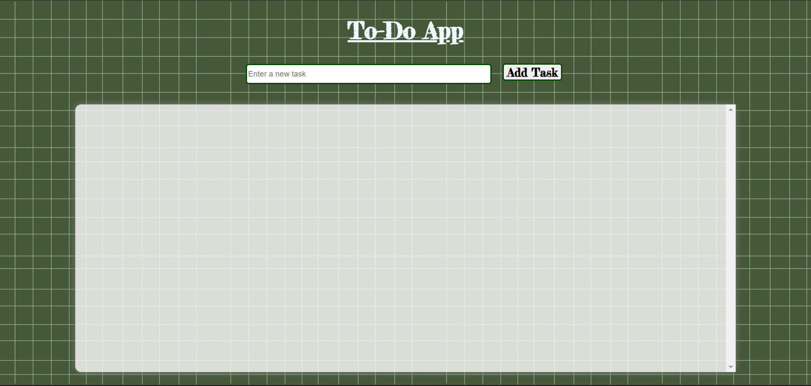

# To-Do App

## Description

A simple To-Do application that allows users to add, delete, and manage tasks. Tasks are stored in the browser's local storage, so they persist between page reloads. This app features a clean and intuitive UI for task management.

## Features

- **Add Tasks**: Enter a task and add it to the list.
- **Delete Tasks**: Remove tasks from the list.
- **Persistent Storage**: Tasks are saved in local storage and persist across page reloads.

## Screenshots

### Screenshot

